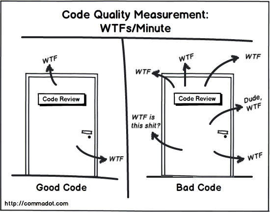
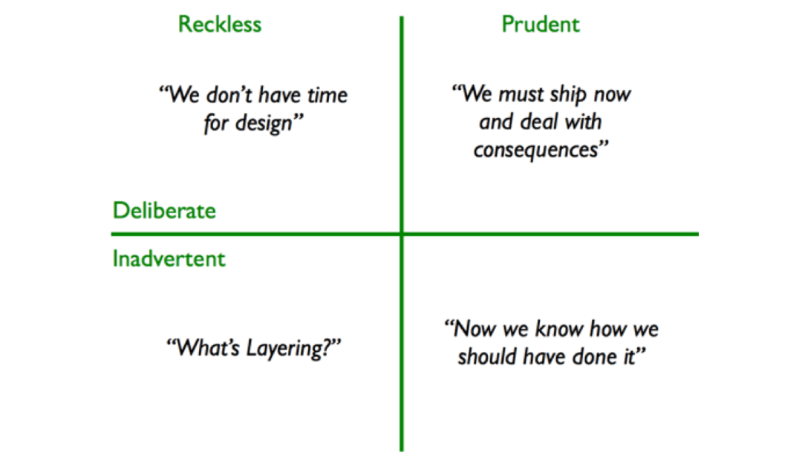
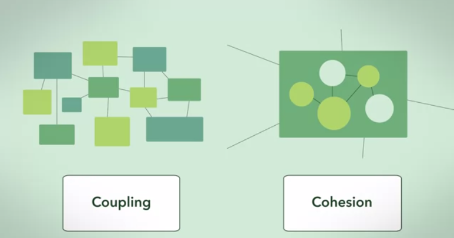
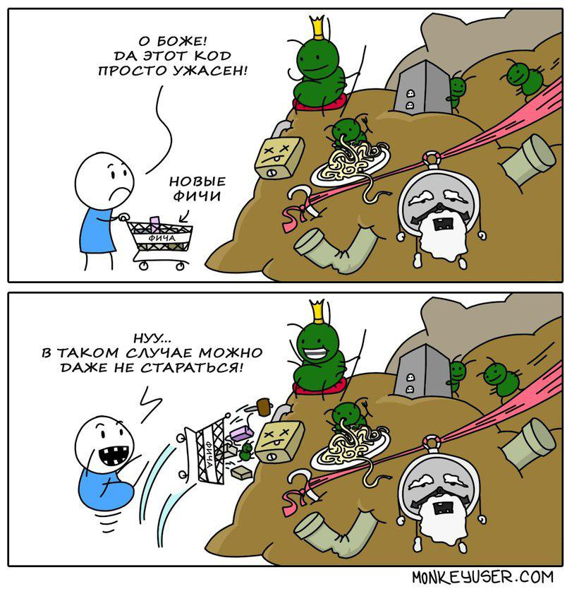
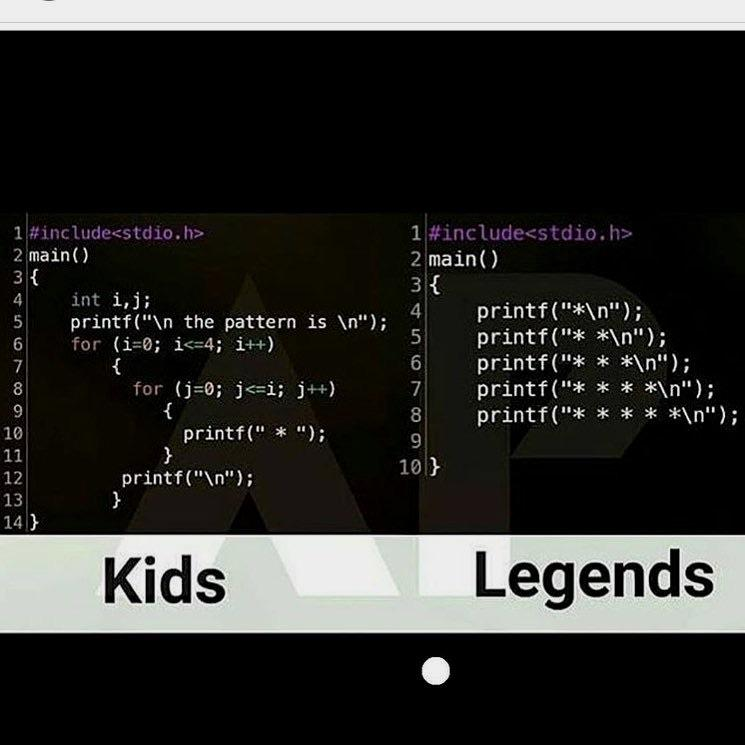

% Maksym Tarasenko

# CLEAN CODE

## Why we should care

- Do not afraid of changes in code base
- Better motivation
- You work is not to write code, which work. You work is to write code, that others can maintain
  - We more read code than write 

# Qualities of clear code

## WTF per minute

## [Good code should...](./What makes good code good?.md)

- **Correct**
- **Well-designed**
- **Readable**
- **Appropriate**
- **Robust**
- **Efficient**
- **Available**
- **Usable**
- **Copyrighted and licenced**
- **Under revision control**

## Clean code

- Obvious for other programmers.
- Doesn’t contain duplication.
- Contains a minimal number of classes and other moving parts.
- Passes all tests.
- Is easier and cheaper to maintain!

## Names

- Choose your names thoughfully
- Communicate your intent
- Avoid Disinformation
- Pronouneble Names
- Avoid encodings
- Choose parts of speech well
	- verbs for fucntions
- Scope length & name length rule
> The larger scope- the larger name
The larger scope - the shorter method and class name

## Functions

- Function should do one thing
- The function doing one thing then you couldn’t meaningfully extract another function from it
- Every line of a function should be on the same level of abstraction. And the 1 level above function name

> When you create a code you do up and down through the abstraction and that’s why we need refactoring 

-  The first rule:- they should be small. The second rule: - They should be smaller than that
-  Do not pass booleans into functions - separate functions
-  Arguments count
-  Avoid switch statements
-  No side effect

## Comments

-every comment is failure to express yourself
 - Comment lie
<!-- silently rot, migrate -->
 - DO NOT COMMENT PIECES OF CODE!
 - NO TODO
 - NO COMMENTED CODE

## Work on task

- Analize reqiurements
- Build architecture/design
- Implement
- Test
- Refactore

## Principles

- **DRY** - Don't repeat yourself
- **KISS** - Keep it simple stupid
- **YAGNI** - You aren't gonna need it
- **SOLID**
  - **S** - Single-responsiblity principle
  - **O** - Open-closed principle
  - **L** - Liskov substitution principle
  - **I** - Interface segregation principle
  - **D** - Dependency Inversion Principle
    <!--
    High-level modules should not depend on low-level modules. Both should depend on abstractions (e.g. interfaces).
    Abstractions should not depend on details. Details (concrete implementations) should depend on abstractions.
    -->

## How to ensure

- Avoid tech dept
- Loose coupling and high cohesion
  <!--
    Cohesion refers to the degree to which the elements of a module/class belong together, it is suggested that the related code should be close to each other, so we should strive for high cohesion and bind all related code together as close as possible. It has to do with the elements within the module/class.
  -->
  <!--
    Coupling refers to the degree to which the different modules/classes depend on each other, it is suggested that all modules should be independent as far as possible, that's why low coupling. It has to do with the elements among different modules/classes.
  -->
- Use patterns/best practices
- Avoid code smells. Refactoring
- Testing
- Stylegides/linting of the code
- Sonar
  <!-- Cyclomatic complexity -->

# Tech dept

> **Technical debt** is a metaphor that equates software development to financial debt.

> Technical debt is anything (code-based, or not)that slows or hinders the development process.

## [3 main types of technical debt](https://hackernoon.com/there-are-3-main-types-of-technical-debt-heres-how-to-manage-them-4a3328a4c50c)

- Deliberate tech debt

  > “We sometimes deliberately incur tech debt to reduce time to market.”

  <!--
  address: plan in backlog
  -->

- Accidental/outdated design tech debt

  <!--
  As systems evolve and requirements change, you might come to the realize that your design is flawed, or that new functionality has become difficult and slow to implement
  -->
  <!--
   address: plan time and refactor
  -->

- Bit rot tech debt

  <!--
    Bit rot tech debt happens over time. A component or system slowly devolves into unnecessary complexity through lots of incremental changes, often exacerbated when worked upon by several people who might not fully understand the original design. Symptoms are, among others, copy-paste and cargo-cult programming.
  -->
  <!--
  address: by continuous refactoring, take time to understand system
  -->

## Martin Fowler’s [Technical Debt Quadrant](https://martinfowler.com/bliki/TechnicalDebtQuadrant.html)

<!--
 reckless(опрометчивый) prudent(предусмотрительный) deliberate(раздумывать) inadvertent(нечаянный)
-->

#### Impacts on individual engineers include:

- Technical debt makes it more difficult to add new software value.
- It makes fixing problems more challenging.
- Getting motivated about working in the code becomes a chore.
- Other job opportunities start looking more appealing.
- At extreme levels, engineers may contemplate a switch in careers.

#### Impacts on teams include:

- Lower velocity, and greater variance in velocity.
- More rigidity in task assignment.
- Less flow within the team.
- Making reliable plans becomes more difficult.
- Again, lower morale and higher turnover.

#### Organizational impacts include:

- Reduced value of software assets.
- Greater difficulty in managing the portfolio of those assets.
- Reduced flow in the software value stream.
- Slower and less reliable responsiveness to both customer and internal problems.
- Greater friction (and thus even more technical debt!) between teams and groups.

## Causes of technical debt

- Business pressure
- Lack of understanding of the consequences of technical debt
- Failing to combat the strict coherence of components
- Lack of tests
- Lack of documentation
- Lack of interaction between team members
- Long-term simultaneous development in several branches
- Delayed refactoring
- Lack of compliance monitoring
- Incompetence

## Coupling and Cohesion

# Patterns

> **Design patterns** are typical solutions to commonly occurring problems in software design.

- Creational patterns
- Structural patterns
- Behavioral patterns

  <!-- Помогают писать более эффективный программный код. Представляют дополнительный уровень абстракции. Упрощают дискуссию между разработчиками -->

## JS patterns

- Callback function
  <!-- Функция обратного вызова – это функция, которая передается в качестве параметра в другую функцию, и в определенный момент будет вызвана из этой функции. -->
- Immediately called function
  <!-- Немедленно вызываемая функция – синтаксическая конструкция, позволяющая вызвать функцию в точке ее определения. -->
- memoize
  <!-- Мемоизация – прием кэширования результатов функции. -->
- Module
  <!-- Шаблон «модуль» - позволяет структурировать и организовывать программный код по мере увеличения его объема. -->

* Singleton
* Factory
  <!-- Фабрика – паттерн использующийся для создания объектов. -->
* Iterator
  <!-- Итератор – представляет собой объект, позволяющий получить последовательный доступ к элементам объекта-агрегата. -->
* Decorator
  <!-- Декоратор – паттерн позволяет динамически подключить поведение к объекту.  -->
* Strategy
  <!-- Стратегия – предназначен для определения семейств алгоритмов и выбора их на этапе выполнения. При этом, для пользователя программного кода, интерфейс объекта остаётся без изменений даже при смене использующегося алгоритма. -->
* Facade
  <!-- Фасад – шаблон позволяет скрыть сложность объекта предоставив альтернативный интерфейс для работы. -->
* Proxy
  <!-- Прокси – объект, который контролирует доступ к другому объекту. -->
* Mediator
  <!-- Посредник– шаблон, обеспечивающий взаимодействие множества объектов, формируя при этом слабую связанность и избавляя объекты от необходимости явно ссылаться друг на друга. -->
* Observer
  <!-- Наблюдатель – создает механизм, который позволяет одному объекту получать оповещения от других объектов. -->
* Front controller pattern

### React patterns

- HOC
- Render props

# [Antipatterns](https://deviq.com/antipatterns/)

> [Software Development AntiPatterns](https://sourcemaking.com/antipatterns/software-development-antipatterns)

- The Blob
- Continuous Obsolescence
- Lava Flow
- Ambiguous Viewpoint
- Functional Decomposition
- Poltergeists
- Boat Anchor
- Golden Hammer
- Dead End
- Spaghetti Code
- Input Kludge
- Walking through a Minefield
- Cut-And-Paste Programming
- Mushroom Management

## Antipatterns

- Create tons of functions
- Use as many one-liners and cryptic code as possible
- Use recursion
- Comments
- Add code, that you might need but never will
- Use lots of variables

# Code smells/Refactoring

## Code smells

> **code smell** is any characteristic in the source code of a program that possibly indicates a deeper problem

# Groups

## Bloaters

<!--
Bloaters are code, methods and classes that have increased to such gargantuan proportions that they are hard to work with. Usually these smells do not crop up right away, rather they accumulate over time as the program evolves (and especially when nobody makes an effort to eradicate them).
-->

- Long Method

- Large Class

- Data Clumps

  <!-- Sometimes different parts of the code contain identical groups of variables (such as parameters for connecting to a database).  -->

- Long Parameter List

- Primitive Obsession

## Tool Abusers

- Switch Statements

  <!-- You have a complex `switch` operator or sequence of `if` statements. -->

- Refused Bequest

  <!-- If a subclass uses only some of the methods and properties inherited from its parents, the hierarchy is off-kilter. The unneeded methods may simply go unused or be redefined and give off exceptions. -->

- Alternative Classes w/ Different Interfaces

  <!-- Two classes perform identical functions but have different method names. -->

- Temporary Field

  <!-- Temporary fields get their values (and thus are needed by objects) only under certain circumstances. Outside of these circumstances, they’re empty. -->

## Change Preventers

- Divergent Change

  <!-- *Divergent Change* is when many changes are made to a single class.
  Single responsibility principle violation -->

- Shotgun Surgery

  <!-- Making any modifications requires that you make many small changes to many different classes. -->

- Parallel Inheritance Hierarchies

  <!-- Whenever you create a subclass for a class, you find yourself needing to create a subclass for another class. -->

## Dispensables

<!-- A dispensable is something pointless and unneeded whose absence would make the code cleaner, more efficient and easier to understand. -->

- Comments
- Lazy class
  <!-- Understanding and maintaining classes always costs time and money. So if a class doesn’t do enough to earn your attention, it should be deleted. -->
- Speculative Generality
  <!-- There’s an unused class, method, field or parameter. -->
- Data Class
- Dead Code
  <!-- A variable, parameter, field, method or class is no longer used (usually because it’s obsolete). -->
- Duplicated Code

## Couplers

- Feature Envy
  <!-- A method accesses the data of another object more than its own data. -->
- Inappropriate Intimacy
  <!-- One class uses the internal fields and methods of another class. -->
- Manage Chains
  <!-- In code you see a series of calls resembling $a->b()->c()->d() -->
- Middle Man
  <!-- If a class performs only one action, delegating work to another class, why does it exist at all? -->

## When to refactor

- Rule of Three
- When adding a feature
- When fixing a bug
- During a code review

## How to refactor

- The code should become cleaner.
- New functionality shouldn’t be created during refactoring.
- All existing tests must pass after refactoring.

## Testing

- You should test
- tests structure should not  be same as project structure

### TDD

[clear code TDD](http://www.butunclebob.com/ArticleS.UncleBob.TheThreeRulesOfTdd)

## Guides

- Easy to replace, not easy to extend
- Avoid Leaking of abstractions
- Align with architecture
- Use dependency injection
  <!-- - How to find bad code
  - Git history(most edited files)
    -->
- Hard code ------------ your code ------------------------ Soft code

# wrapping up

## OK

## Tips

1. You are responsable for the quality of your code
2. Use meaningful names
3. Write code that expresses intent
4. Comments are often lies waiting to happen. Code should speak for itself whenever possible
5. "Boy Scout Rule"
6. ["Broken windows theory"](https://en.wikipedia.org/wiki/Broken_windows_theory)
7. Single responsebility principle
8. Write tests
9. Work in short cycles: incremental and iteractive
10. Independent Architecture
11. Composition over inheritence
12. Practice, practice, practice
13. Fail fast, recover quickly

## Kids vs Legends

## Questions?

Questions?

## Some links

- [Code Refactoring: Learn Code Smells And Level Up Your Game!](https://youtu.be/D4auWwMsEnY)
- [SOLID](https://ota-solid.now.sh/srp/in-ideal-world)
- [First wiki](https://c2.com/)

### Books
- Object Oriented Software Engineering: A Use Case Driven Approach

TODO

- CAP theorem

## Paradigms

- Procedural programming
- OOP
- FP
- Aspect-oriented programming
